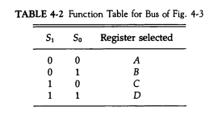

# Chapter 4: Register Transfer and Microoperations

This chapter in *Computer System Architecture* by M. Morris Mano focuses on how data is moved and manipulated within the computer system at the register level.

---

## 4.1 Register Transfer Language

### Key Concepts:
- **Register**: A small, fast storage location within the CPU that holds data temporarily.
- **Register Transfer**: Moving data from one register to another under the control of a timing signal.
- **Register Transfer Language (RTL)**: A symbolic notation used to describe the microoperations between registers.

### Details:
1. **Basic Notation**:
   - `R1 ← R2`: Indicates the content of `R2` is transferred to `R1`. 
   - 

2. **Conditional Transfers**:
   - Example: `P: R1 ← R2`
     - The transfer happens only if `P` is true.
     - `P` can represent a control condition, e.g., a flag in the processor.

3. **Implementation**:
   - A register is equipped with:
     - **Output Lines**: Enable the transfer of the register's data.
     - **Input Lines**: Accept data from another register or memory.
   - A control signal ensures the transfer occurs only at the right time.

---

## 4.2 Register Transfer

### How it Works:
1. **Common Bus System**:
   - Registers are connected via a common bus.
   - Only one register can place data on the bus at any given time.
   - 
   - 

2. **Control Logic**:
   - Enable signals activate the output of the source register.
   - Load signals enable the destination register to accept data.

### Hardware Representation:
- **Multiplexers**: Direct the appropriate register's data onto the bus.
- **Decoders**: Select the destination register for loading data.
- **Control Signals**: Coordinate the timing of data transfer.

### Example:
To transfer `R1 ← R2`:
1. Activate `R2`'s output line.
2. Route data through the bus to `R1`.
3. Activate `R1`'s load signal to store the value.

---

## 4.3 Arithmetic Microoperations

### Overview:
These microoperations perform basic arithmetic tasks using registers.

### Types:
1. **Addition**:
   - `R1 ← R2 + R3`
   - Requires an ALU with an adder circuit.
2. **Subtraction**:
   - `R1 ← R2 - R3`
   - Typically implemented as `R1 ← R2 + ¬R3 + 1` using two's complement arithmetic.
3. **Increment/Decrement**:
   - `R1 ← R1 + 1`
   - `R1 ← R1 - 1`

### Hardware Implementation:
- Uses an **Arithmetic Logic Unit (ALU)** to perform operations.
- Control signals dictate the specific operation.

### Examples:
1. **Binary Addition**:
   `R1 = 1100, R2 = 1010`  
   Result: `R1 ← 1100 + 1010 = 10110` (5 bits due to carry).

2. **Two's Complement Subtraction**:
   `R1 = 1010, R2 = 0011`  
   Compute `R1 - R2`:
   - Take two's complement of `R2`: `¬R2 + 1 = 1100 + 1 = 1101`.
   - Add `R1 + (two's complement of R2)`: `1010 + 1101 = 10111`.

---

## 4.4 Logic Microoperations

### Purpose:
Logical operations manipulate bits in registers.

### Key Operations:
1. **AND**:
   - `R1 ← R2 ∧ R3`
   - Bitwise AND on corresponding bits.
2. **OR**:
   - `R1 ← R2 ∨ R3`
3. **XOR**:
   - `R1 ← R2 ⊕ R3`
4. **NOT**:
   - `R1 ← ¬R2`

### Examples:
1. **Bitwise AND**:
   `R1 = 1010, R2 = 1100`:  
   Result: `R1 ← 1010 ∧ 1100 = 1000`.

2. **XOR**:
   `R1 = 1010, R2 = 1100`:  
   Result: `R1 ← 1010 ⊕ 1100 = 0110`.

   - 

### Applications:
- **Masking** (e.g., clearing or isolating certain bits).
- **Decision-making** in control logic.

---

## 4.5 Shift Microoperations

### Purpose:
Shift operations move bits in a register left or right for specific purposes (e.g., arithmetic operations, alignment).

### Types:
1. **Logical Shift**:
   - Shifts bits left or right.
   - Vacant positions are filled with `0`.

2. **Arithmetic Shift**:
   - Preserves the sign bit during shifts.
   - Typically used for signed numbers.

3. **Circular Shift (Rotate)**:
   - Shifts bits and wraps the displaced bits to the opposite end.

### Examples:
1. **Logical Shift Left**:
   `R1 = 1010`:  
   Result: `R1 ← 0100`.

2. **Arithmetic Shift Right**:
   `R1 = 1010` (signed):  
   Result: `R1 ← 1101` (sign bit preserved).

   - 

---

## 4.6 Arithmetic Logic Shift Unit

### Purpose:
A multifunctional unit combining arithmetic, logic, and shift operations in a single hardware structure.

### Structure:
1. **Control Lines**:
   - Determine which operation to perform (e.g., arithmetic, logical, or shift).
2. **Multiplexers**:
   - Select inputs and outputs based on the control signals.
3. **ALU**:
   - Performs arithmetic and logical operations.
4. **Shift Circuit**:
   - Handles left and right shifts.

### Control Table:
| Control Line | Operation                |
|--------------|--------------------------|
| 00           | Addition                 |
| 01           | Logical AND              |
| 10           | Shift Left               |
| 11           | Shift Right              |

---

## 4.7 Microoperations Control

### Purpose:
Control signals govern the execution of microoperations in a system.

### Control Signal Examples:
1. To perform `AC ← AC + DR`:
   - Enable `DR`'s output to the ALU.
   - Select the addition operation in the ALU.
   - Enable `AC`'s load line.

### Timing:
- Synchronized using clock pulses to avoid conflicts between operations.

---

## Applications of Chapter Concepts

1. **Basic Data Transfer**:
   - Registers move data efficiently within the processor.
2. **Arithmetic and Logical Operations**:
   - Essential for computation and decision-making.
3. **Shift Operations**:
   - Used in cryptographic algorithms, data alignment, and efficient multiplication/division.
4. **Integrated Control**:
   - Ensures operations are carried out accurately and efficiently.

---
